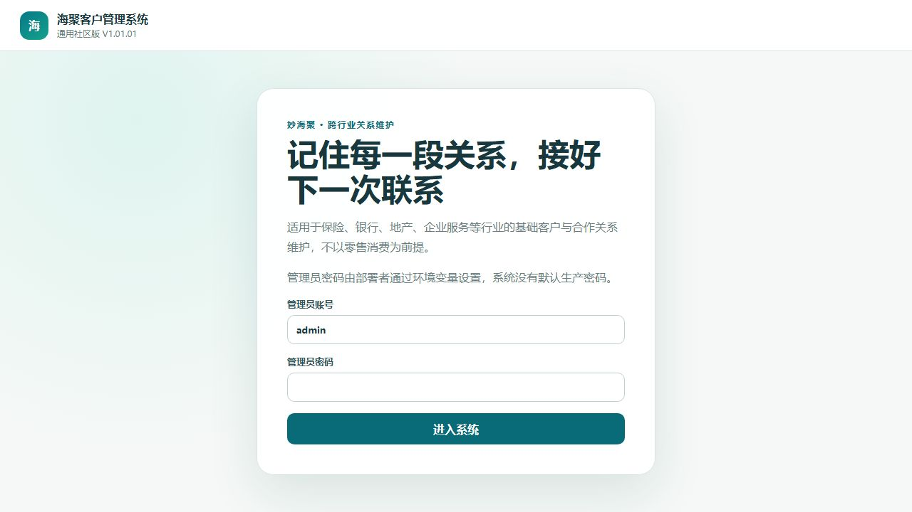
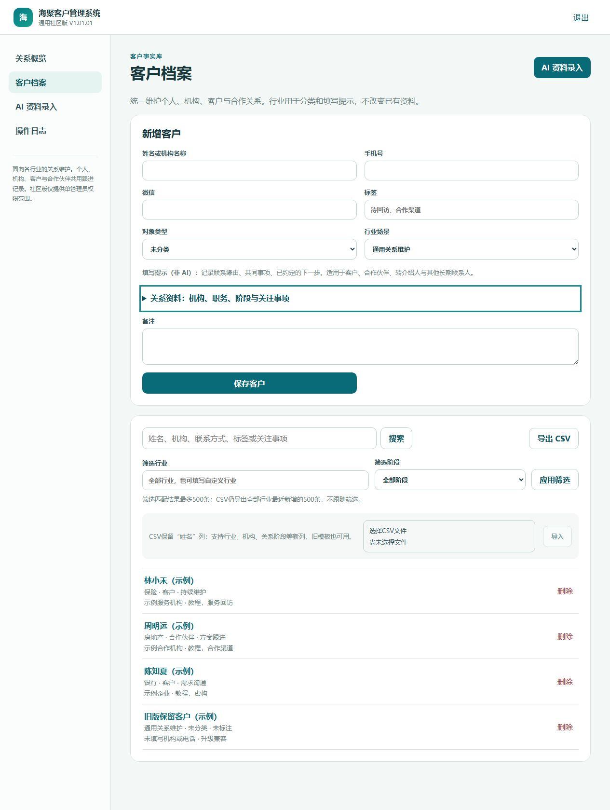
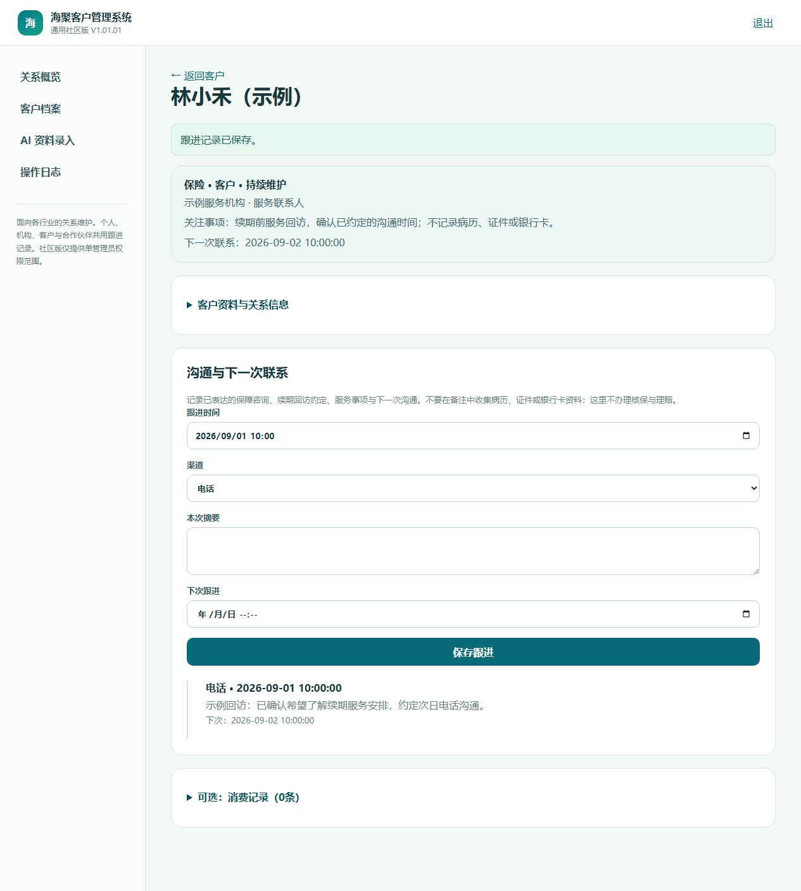
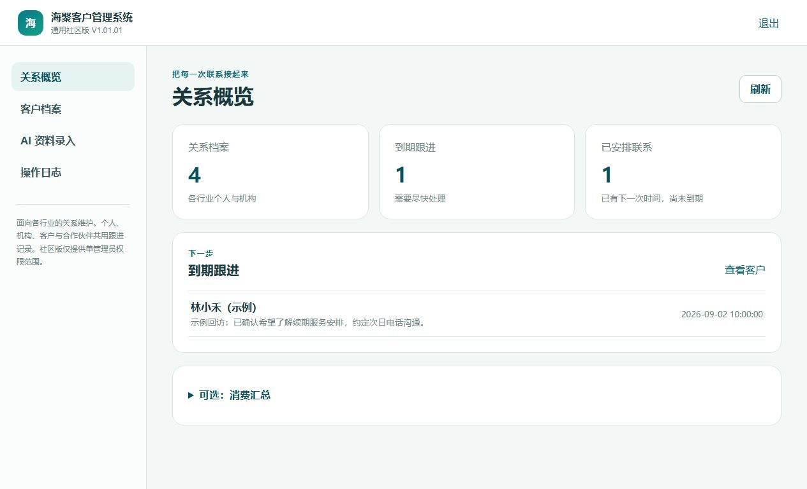
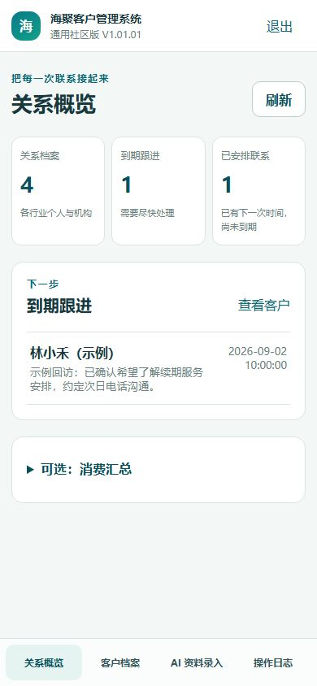
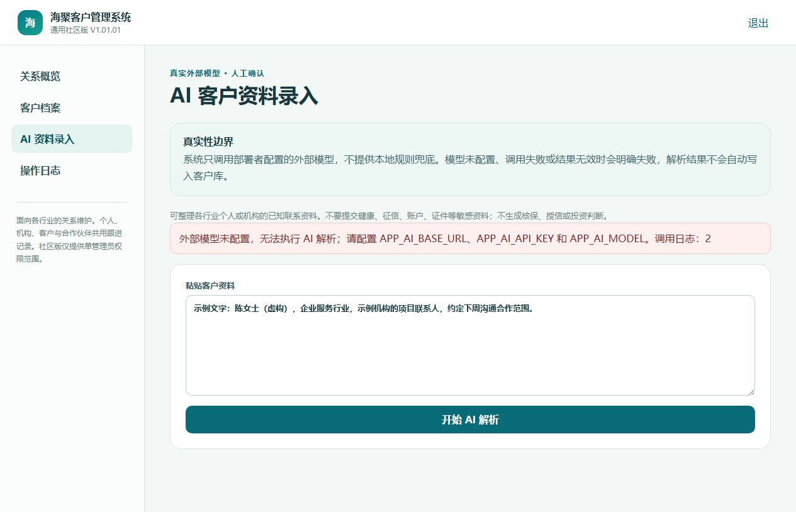
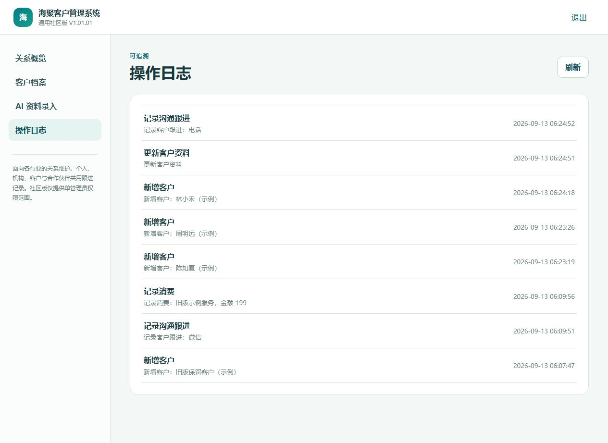

# 使用教程：从第一个客户到下一次跟进

适用社区版V1.01.01。以下截图来自真实运行的社区系统，所有档案和业务事项均为虚构练习资料。系统用于跨行业关系维护，不以零售或发生消费为前提。

[返回首页](../README.md) · [部署教程](DEPLOYMENT.md) · [多行业应用](INDUSTRY_SCENARIOS.md) · [下载练习CSV](examples/customers-sample.csv)

## 1. 登录与页面入口

系统管理员提供访问地址和账号；本机默认访问 `http://localhost:8088/login`。账号密码来自部署配置，没有注册、找回密码邮件或默认生产密码。忘记密码请让部署管理员按部署教程修改配置并重建后端。

登录后使用四个入口：

| 入口 | 用途 |
| --- | --- |
| 关系概览 | 看关系档案、到期跟进、未来联系及当前待办；消费汇总可选展开 |
| 客户档案 | 新增/搜索/编辑客户、导入导出、进入详情 |
| AI资料录入 | 将文字交给已配置的外部模型解析，人工核对后保存 |
| 操作日志 | 查客户、跟进、消费等操作记录 |

社区版只有一个管理员权限范围，没有员工账号分配、多门店数据隔离或逐人业绩。右上角“退出”用于清除当前页面登录凭据；共享电脑用完应主动退出。

## 2. 新增、查找和编辑客户

进入“客户档案”，在“新增客户”填写：

- **姓名或机构名称**：必填，最长100个字符；CSV列名仍使用“姓名”以兼容旧模板。
- **手机号**：选填。填写时请统一格式；相同非空手机号不能重复保存。没有电话时留空，不要为了通过表单编造号码。
- **微信**：选填，最长100个字符。
- **标签**：选填，例如“待回访，合作渠道”，作为便于搜索的文字，最长500个字符。
- **备注**：选填，最长5000个字符。

选择**对象类型**和**行业场景**。保险、银行、房地产、企业服务、教育培训、专业服务、零售、通用关系维护提供静态填写提示；选择“自定义行业”可填写其他行业。提示明确标为“非AI”，不会自动填写客户事实。

展开“关系资料”可填写：所属机构（200字符）、职务（100）、邮箱（200且格式有效）、关系类型、关系阶段及关注事项（2000）。阶段由你按实际情况选择，不自动办理行业审批或生成商机。保存后这些内容进入数据库，不只留在页面。

点击“保存客户”，确认成功提示及下方列表。截图采用保险、银行、地产和旧版升级保留的虚构档案，不含真实客户信息。

搜索支持姓名、手机号、微信、标签、所属机构、邮箱和关注事项。行业筛选可选提示值或填写自定义行业；阶段选择后点“应用筛选”。列表最多显示最近新增的500条匹配记录，不是带分页的完整客户清单。

点击姓名进入详情，首屏显示行业、关系类型、阶段、关注事项与下一次联系。展开“客户资料与关系信息”编辑后点“更新客户资料”。切换行业只改变分类和提示，不改写其他已填内容。重复手机号仍需先核对，当前没有自动合并入口。

## 3. 从Excel或其他表格导入

1. 打开 [练习CSV](examples/customers-sample.csv)，在GitHub文件页点击“Download raw file”保存原始CSV（不要把网页另存为HTML）。所有姓名带“示例”，手机号刻意留空，不对应真实人员。
2. 使用Excel、WPS或文本编辑器整理资料。第一行推荐保留：`姓名,手机号,微信,标签,备注`；其中“姓名”列必须存在，其他列可选。
3. **另存为CSV UTF-8**，不要直接上传XLSX或改后缀。含英文逗号、双引号或换行的单元格需要标准CSV引号转义，可让表格软件处理。
4. 在客户页选择文件，再点“导入”。完成后核对页面“新增”和“跳过”的数量，并检查列表和操作日志。

旧版练习CSV首次导入会新增2位客户，行业默认为“通用关系维护”，关系类型为“未分类”、阶段为“未标注”，再根据事实编辑。也可以追加新列：`对象类型,行业,所属机构,职务,邮箱,关系类型,关系阶段,关注事项`。行业和关系字段可使用中文自定义值；固定选项是填写提示，不是后端白名单。

姓名为空的行和手机号已存在的行会跳过，导入不更新已有同手机号客户。其他字段格式或长度无效会让**整批回滚**，修正CSV后重试；不要把这类失败当作部分导入成功。手机号为空时没有该去重保护，重复导入练习CSV会再次新增。因此不要连续重复导入，先核对结果与日志。

单次最多5000个数据行。默认网页入口还受Nginx请求体大小限制，建议每份CSV小于1MiB；后端自身最大文件为2MB。数据量大时拆分文件，不把“文件限制”和“5000行限制”当成同一回事。

## 4. 导出客户

在客户页点击“导出CSV”，浏览器会下载 `haiju-customers.csv`。保留姓名、手机号、微信、标签、备注五列，并追加八列关系字段；导出含行业、机构、阶段和关注事项。

**当前导出最多包含最近新增的500位客户，并且不跟随搜索框筛选。** 跟进、消费、操作日志不在这个CSV里。因此CSV用于资料整理，不能代替 [数据库备份](DEPLOYMENT.md#8-数据库备份)。

以 `=`、`+`、`@`、`-` 开头的文本在导出时可能带保护前缀，这是防止表格公式执行的处理，不代表客户数据变成了公式。处理后如需重新导入，先抽样核对字段内容。

## 5. 记录跟进与安排下次联系

进入客户详情，在“沟通与下一次联系”填写：

1. 本次实际跟进时间。
2. 渠道：微信、电话、邮件、面谈、上门拜访、视频会议、到店或其他。
3. “本次摘要”：记录沟通事实和下一步，最长1000个字符。
4. 需要提醒时填写“下次跟进”；不得早于本次时间。
5. 点击“保存跟进”，确认成功提示及下方时间线出现新记录。

保险续期回访、银行服务沟通、地产带看反馈等都走这条真实跟进链路。“下次跟进”到期后会出现在关系概览。系统取的是该客户**最后新增的一条跟进记录**，不是所有历史记录，也不是按填写的跟进时间选“最新”。因此补写旧记录也可能改变当前提醒。

完成回访后，新增一条本次跟进：需要继续联系就填下一次时间，暂不安排就留空。再回到概览点“刷新”，旧的到期待办就会被这条新记录替代。提醒不会自动发微信或短信，也没有独立的“完成待办”按钮。

当前跟进记录没有单条编辑或删除入口。录错摘要时可新增一条更正说明；更正时同时检查下次跟进时间，避免误改提醒安排。

## 6. 可选：记录消费

只有确需记录真实消费时才展开“可选：消费记录”，填写消费时间、金额、项目及可选备注，再点“保存消费”。金额不能为负，最多按页面精度输入到分；项目必填。不需要记账的保险、银行、地产或其他联系人完全可以不用此区，已有消费记录仍保留。

成功后详情时间线可看到记录，关系概览的“可选：消费汇总”可查看合计。它不是收款流水、净利润或员工工资，更不是保额、授信额度、资产余额或房产意向总价，不能混合填写这些金额。

**当前没有消费编辑、单笔删除、退款、负数冲销或订单去重功能。** 保存前仔细核对金额和时间，避免重复点击；出现不确定结果先刷新详情查证。误录金额不要用再次录入或删除整个客户来“抵消”，应停下核对并联系维护者制定修正方案。

## 7. 查看关系概览和提醒

- 关系档案：所有已保存的个人和机构档案，不受列表500条显示限制影响。
- 到期跟进：按照上一节规则统计当前到期的客户。
- 已安排联系：每个客户当前有效下一次联系尚未到期的数量；与到期数量分开统计。
- 消费汇总：需要时手工展开，不再作为所有行业的默认核心指标。
- 到期列表：点击客户进入详情处理；列表最多200条，可能少于上方总数。操作后可点“刷新”更新。

截图展示虚构档案与真实保存的联系计划。手机端同样可以使用：

日期时间显示为不含时区标记的日期文字。跨时区使用或提醒明显提前/滞后时，让部署管理员核对数据库和浏览器时间；不要靠反复修改真实记录补偿时差。

## 8. AI文字录入

先让部署管理员配置 [外部模型三项参数](DEPLOYMENT.md#6-可选连接外部ai模型)。网页中没有密钥配置框。

1. 进入“AI资料录入”，粘贴你有权交给该服务商处理的客户文字。首次测试使用虚构资料。
2. 点击“开始AI解析”，等待外部模型返回。
3. 成功时页面显示模型来源、调用日志编号和“请人工核对后保存”表单。
4. 检查姓名/机构名称、联系方式、标签和备注；同时核对行业、机构、职务、邮箱、关系类型、阶段和关注事项。未知信息保持未分类或留空，确认没有补造事实，再点“确认并保存客户”。
5. 到“客户档案”搜索并打开新客户，核对保存结果。

单次文字上限20000字符。解析不会自动保存客户；未配置、调用失败或返回无效结构时会明确提示错误。已有同手机号客户不能用这条入口覆盖更新。

这张图是实际未配置模型的失败状态，**不是AI成功演示**。成功分支的操作说明依据当前界面和后端实现核对，本次没有使用真实付费模型实测。普通客户管理不要求配置AI。

## 9. 操作日志与排错

操作日志页面直接显示**新增客户、更新客户资料、导入客户资料、记录沟通跟进、记录消费、删除客户**。历史日志也会显示中文；未知动作显示“其他操作”。原英文代码只保留在数据库/API中用于审计兼容，不再作为页面标题。日志帮助确认发生过什么，不是可以撤销或还原全部数据的历史快照。

AI错误中的调用日志编号属于另一张AI日志表，当前操作日志页不提供AI日志管理界面。遇到问题时向部署管理员提供版本、时间、动作和日志编号；不要把客户原文或密钥发到公开Issue。

## 10. 删除客户前要知道

在客户列表点“删除”，系统会显示确认框。取消不会删除；确认会删除该客户，并级联删除其全部跟进和消费记录。总客户数、累计消费和提醒会随之变化。

没有回收站、撤销按钮或“恢复已删除客户”页面。操作日志只保留删除事实，不能还原完整档案。确实需要删除时先确认对象并准备数据库备份；只是录错一个字段，应编辑该字段而不是删客户重建。

## 第一次使用的核对单

- 用一位虚构客户练习新增、编辑和搜索。
- 导入样例CSV一次，核对新增2条；下载CSV检查内容。
- 分别建立保险、银行或地产虚构关系，记录一次沟通并安排下一次联系，在详情与概览确认回显。
- 切换行业/阶段筛选，导出后核对关系字段；只有需要时再练习消费记录。
- 再新增跟进，确认下一次提醒符合安排。
- 正式录入前由管理员完成备份恢复演练；不要把样例数据混进正式账目。

部署故障见 [部署教程常见问题](DEPLOYMENT.md#常见问题)。
